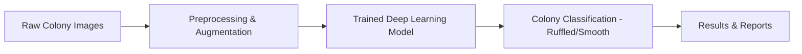
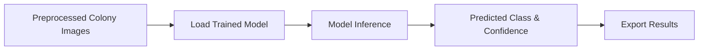

# Cullen Colony Classifier v1

This project introduces the first version of the Cullen Colony Classifier (CCC), a machine learning system designed to classify yeast colony images.

## Overview

CCC is a complete pipeline for automated classification of yeast colony morphology. The system takes raw colony images, applies preprocessing and data augmentation, and uses a deep learning model to classify each colony as either "ruffled" or "smooth". The workflow covers data preparation, model training, evaluation, and batch inference for new datasets. CCC aspires to ease of use in laboratory settings, supporting reproducible and scalable analysis of colony images.

The system was developed using Visual Studio Code and GitHub Copilot with the GPT-4.1 LLM. The TensorFlow Keras code is based on the [TensorFlow Image Classification](https://www.tensorflow.org/tutorials/images/classification) tutorial, with modifications to separate the training and inference components.

### Equipment Used

CCC was primarily developed on a Dell XPS laptop, with a custom-built desktop used for model training and inference.

#### Hardware

- Dell XPS 9500 laptop
  - Intel® Core™ i9-10885H (16 cores)
  - 32 GB RAM
  - 2 TB NVMe drive
  - NVIDIA GeForce GTX 1650 Ti (4GB VRAM)

- Custom Built Desktop
  - AMD Ryzen 7 5700X (8 cores)
  - 64 GB DDR4 RAM
  - NVIDIA GeForce RTX 4600 Ti (16GB VRAM)
  - Various SSD and NVMe SATA drives

#### Software

- Debian Linux 13
- Python 3.12
- TensorFlow Keras
- Visual Studio Code
- Microsoft GitHub Copilot
  - GPT-4.1 LLM
- Ollama
  - qwen3-coder:30b LLM

## Colony Image Data Set

The dataset used for this project consists of labeled yeast colony images, divided into two classes: "ruffled" and "smooth". Each image was manually annotated based on colony morphology. The dataset is organized into subfolders by class and is used for both training and evaluation of the classifier.

- 164 images totaling 1.2GB were used for training the model.
- 1018 images totaling 7.0GB were classified.

### What is a "small or medium-sized dataset"?

- **Small dataset:** Fewer than 5,000 labeled images in total (often <1,000 per class).
- **Medium dataset:** Between 5,000 and 50,000 labeled images in total (typically 1,000–10,000 per class).
- **Large dataset:** More than 50,000 labeled images (e.g., ImageNet scale).

For yeast colony classification, most lab datasets are considered "small" or "medium" by these definitions.

## Model Training

The model training process uses a deep learning approach based on the MobileNetV2 architecture, a widely used neural network for image classification. Images are first preprocessed and optionally augmented to improve generalization. The data is split into training and validation sets to monitor performance and prevent overfitting.

During training, the model learns to distinguish between "ruffled" and "smooth" yeast colonies by analyzing labeled example images. The system automatically adjusts for any imbalance between classes to ensure fair learning. Training progress is monitored, and the best-performing model is saved for later use.

After training, the model's accuracy and other performance metrics are evaluated. The trained model is then used to classify new colony images.

## Classification

The classification stage takes preprocessed yeast colony images and uses the trained deep learning model to predict the morphology of each colony. This process can be run in batch mode for large datasets or interactively for single images. The classifier outputs the predicted class ("ruffled" or "smooth") along with a confidence score for each image. Results can be exported for downstream analysis or reporting.

## Running CCC

To generate the final inference results, CCC was run multiple times on the custom desktop computer using an automated workflow. For each run, the model was trained from scratch and then used to classify the full set of colony images. The results from each classification were recorded in a single database file for further analysis.

This approach ensures that the reported results are robust and reproducible, as it accounts for any variability in model training. By repeating the process multiple times, the team could assess the consistency of the classifier's predictions and obtain a comprehensive summary of model performance across all images.

The final outputs include a database of classification results and a spreadsheet summarizing the predictions, which can be used for downstream scientific analysis and comparison with manual classifications.

The final analysis was delivered to the Cullen Signaling Lab team in two files:

- `classification_results_20260106_083325.db`: a sqlite3 database containing the inference results for each image in the dataset.
- `ccc_classifications - 20260112.xlsx`: an Excel spreadsheet containing the results extracted from the sqlite3 database.

## Next Steps for CCC

- Add additional training images.
- Support multiple classification labels per image.
- Improve the training algorithm, including:
  - support for multiple image classification model architectures,
  - configurable augmentation steps,
  - running training on more powerful servers.
- Use CCC to classify other yeast colony image datasets.